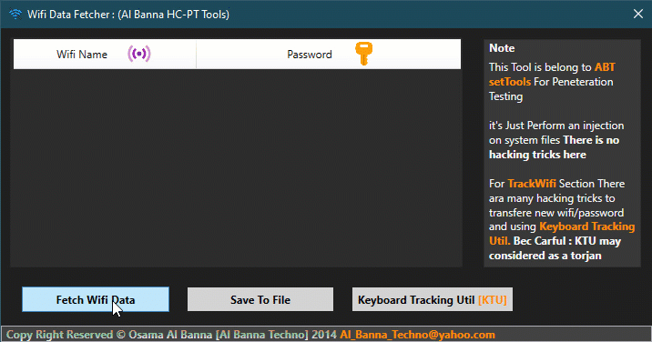

# Osama Al Banna Resume

#### Last Update Date : 2019/12/26
Please Use [this](https://mega.nz/#F!D842mApK!D1JFDLdPXWJUrc4okvXj7g!rh4g3KrI) decrypted mega link to download/show the cv

Please Notice : To protect this file from any manipulation i signed it
* Internally with : Foxit Phantom
  * To check it press on the signature at the right bottom corner of this page (may not working on the browser)
  
* [Externally With : GPG](https://www.phildev.net/pgp/gpginstall.html)
  * [Signature File : named [this file name].pdf.sig](https://www.thesecuritybuddy.com/pgp-and-gpg/digital-signature-using-gpg/)
  * My Fingerprint : `3C0CF524B1AE5C08D2CF1576CB13D5ABD30D7F9A`

### Projects Review

#### Some projects can not published as a public repository to github now so i will provide a preview for those projects 
* [PreviewsLink](https://mega.nz/#F!r8xk1CwJ!W5Gz_we0mjXbBufCfvABmQ)

#### Project Previews in details

##### [DateBook](https://mega.nz/#F!SxpigCRK!OcOXxDvfqRPZvVOwJH-XTQ)
  * Dating Social App
  * Use Next Technologies
    * Backend : Asp.net Core Web API  `3.0 => 3.1`
    * Frontend Container : Angular8
    * UI Helpers : ngx-bootstrap
    * Sqlite & SqlServer
  * Patterns
    * Based On repository pattern
    * Respect Modularitys & SOLID Design Principles

 
#### [GraniteHouse](https://mega.nz/#!C8wQnCxJ!Lbnq0kbc2RUpqWAOq9k7UuRgzIaX6gsFxuTLOwvU6A8)
   * Granite Trading Site
   * Technologies
     * Asp.net Core MVS
     * Razor Pages `For Registeration System`
     * SqlServer
     
#### [AbtWifiPassUI](https://mega.nz/#!L0oVmQwI!-kvdJX0QLk9uvTGry1_tIa8PwNo2sNgJy0UFekZvbSo)
  * UI Utils Allow to fetch all saved wifi passwords from local machine
  * developed with wpf & windows system sdk
  * [Silent Version](https://mega.nz/#!exoWxAwb!vOMtRkZwN8gDLZo0W3DikKYmPr_AZiskCYb5h8YHomw) : `fetch password list in by just click on exe file and save it to exe location`
    * developed with windows form
    
  

#### [Wpf Simple Store Manager](https://mega.nz/#!To5Q0KwR!54FHe9rOf3spao3U-pf0F35E50N4cazykYAxF1hm5EQ)
   * The main purpose of this app is demonstrate using pointers between different windows without losing data in wpf app
   * Technologies
     * Wpf
     * SqlServer & SQLite
